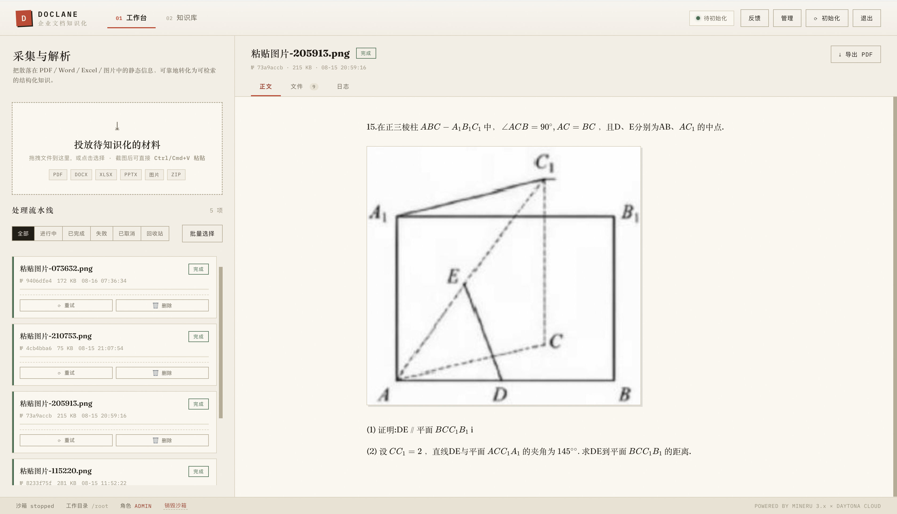
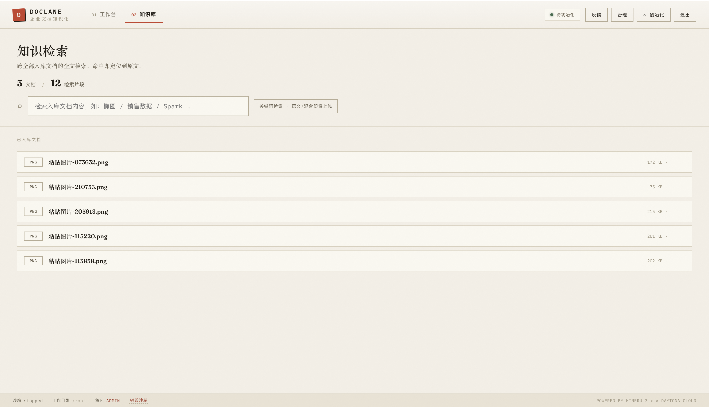
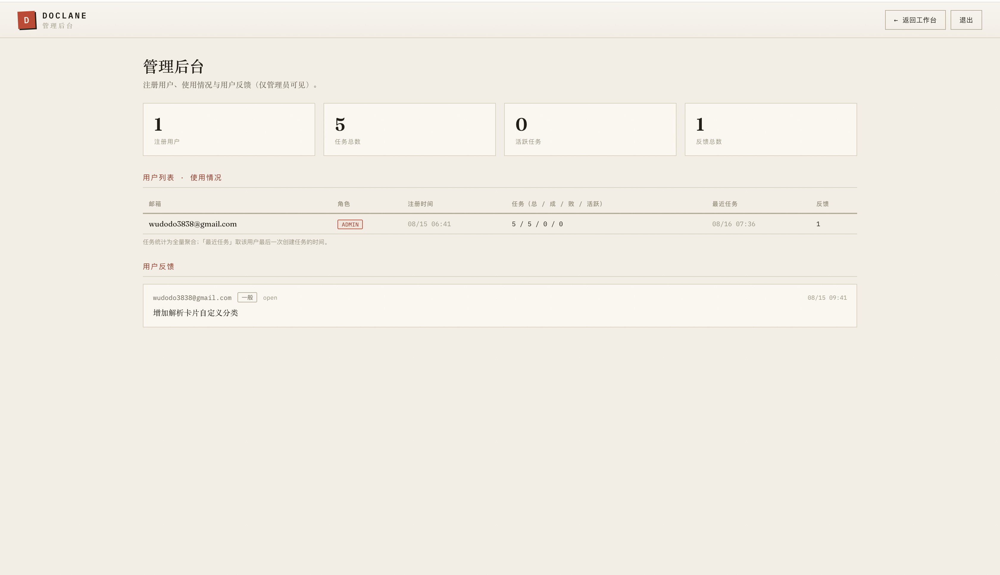

# DOCLANE · 企业文档知识化平台

> 上传即解析，把散落的文档变成可检索的知识。

<p align="center">
  <b>MinerU</b> × <b>Daytona</b> × <b>Supabase</b> × <b>Vercel</b>
</p>

PDF / Word / Excel / PPT / 图片 上传即解析：云端引擎完成版面还原与内容提取，自动入库知识库，支持中文全文检索与命中高亮直达原文。**云端多用户 + 本地单用户**两种模式共用同一套核心流水线。

---

## 📑 目录

- [界面预览](#-界面预览)
- [特性](#-特性)
- [双模式：云端 / 本地](#-双模式云端--本地)
- [架构](#-架构)
- [快速开始](#-快速开始)
- [环境变量](#-环境变量)
- [API 概览](#-api-概览)
- [安全设计](#-安全设计)
- [成本模型](#-成本模型)
- [项目结构](#-项目结构)
- [Roadmap](#-roadmap)

---

## 🖼️ 界面预览

| 工作台（上传 · 解析 · 正文） | 知识库（检索 · 命中高亮） | 管理后台（用户 · 审计） |
|---|---|---|
|  |  |  |

> 截图存放于 `docs/screenshots/`，命名与拍摄要点见 [docs/screenshots/README.md](docs/screenshots/README.md)。

---

## ✨ 特性

- **多格式解析**：PDF / DOCX / XLSX / PPTX / 图片，MinerU 引擎完成版面分析、OCR、公式与表格还原
- **快照秒开算力**：MinerU + 2.5GB 模型烘焙进 Daytona 快照，沙箱 10 秒拉起、模型自带、销毁重建零成本
- **零常驻进程**：一次性任务执行器（`drain.py`）处理完即退出，**只为任务付费**，空闲零成本
- **每用户独立沙箱**：从共享快照按用户拉起独立沙箱，用完即毁、互不干扰
- **自动入库知识库**：解析结果自动切分入库，中文 bigram 关键词检索，命中片段高亮直达原文
- **双模式**：云端多用户（Supabase 认证/存储/RLS）与本地单用户（SQLite + 文件）共用同一套路由与流水线
- **权限与审计**：Supabase RLS 行级安全 + user/admin 角色 + 操作审计留痕
- **安全加固**：UUID 参数校验防注入、接口级属主校验防越权、任务配额防资源滥用

---

## 🧭 双模式：云端 / 本地

同一个代码库、同一套 `routes/*` 路由、同一份 `drain.py` 流水线，通过数据门面 `api/_lib/store.js` 切换后端：

| | 云端模式 | 本地模式 |
|---|---|---|
| 入口 | Vercel `api/entry.js` | `node server-local.js` |
| 认证 | Supabase Auth（邮箱密码，多用户） | 免登录（单用户即管理员） |
| 数据 | Supabase Postgres + Storage | 本机 SQLite + `data/` 目录 |
| 算力 | Daytona 云沙箱 | Daytona 云沙箱（同样快照秒开） |
| 检索 | `pg_trgm` 关键词 | 本地 SQLite `LIKE` 关键词 |
| 适用 | 上线给访客/面试官体验 | 个人使用、数据留在本机 |

> 核心原则：**任务执行流水线只有一份（`runner/drain.py`）**，两模式差异仅在于「数据持久化目标」——详见 [docs/review-local-vs-cloud.md](docs/review-local-vs-cloud.md)。

---

## 🏗️ 架构

核心命题：**如何以最低成本、最快速度，把"文档解析"这种计算密集型任务搬上云，并做成可多人使用的服务**。三个关键决策：

**① 计算与状态分离（无服务器 API + 云端沙箱计算）**

```
浏览器 ──HTTPS──▶ Vercel（无服务器 API，认证/编排/审计） ──REST──▶ Supabase（Auth/数据/存储/RLS）
                        │ 上传时 ensure
                        ▼
                  Daytona 云沙箱（快照秒开 · drain.py 一次性执行器）
                        │ 下载输入 → MinerU 提取 → 切段入库 → 退出
```

- 面向用户的 API 是无状态轻函数（<10s），不跑长任务、不中转文件体（大文件浏览器**预签名直传** Storage）
- 计算发生在按需创建的云沙箱内，与业务状态完全解耦

**② 快照烘焙模型（构建一次，秒开 N 次）**

```
Dockerfile（安装 MinerU + 下载 2.5GB 模型） ──构建──▶ 快照（模型已烘焙进镜像层）
                                                        │
                                  ┌─────────────────────┼────────────────────┐
                                  ▼                     ▼                    ▼
                          沙箱 A（用户甲）        沙箱 B（用户乙）       沙箱 C（……）
```

**③ 一次性执行器（drain.py）—— 只为任务付费**

- `drain.py` 是**纯 Python 标准库、零依赖**的任务执行器，由函数在任务上传时注入沙箱并 `nohup` 启动；`collect_outputs()` 是切段/bigram/入库的**唯一实现**，云端与本地共用
- 处理完即退出，不留常驻进程；任务结束回调 `release`，无排队任务即销毁沙箱
- 三层兜底防失控：任务超时（`JOB_TIMEOUT_MIN`）→ 沙箱空闲停机（`AUTO_STOP_MINUTES`）→ 沙箱寿命上限（`SANDBOX_TTL_MIN`）

**任务生命周期**

```
上传文件 → 创建任务(queued) → 浏览器直传 Storage → 标记 uploaded → ensure
    → 按用户拉起/复用沙箱（快照秒开）→ 注入 drain.py → 下载输入
    → MinerU 提取 → 上传产物 → 切分入库（documents/chunks）→ status=done
    → release 回调：无排队任务则销毁沙箱（用完即毁）
```

---

## 🚀 快速开始

### 前置条件

- [GitHub](https://github.com) 账号（代码仓库）
- [Vercel](https://vercel.com) 账号（托管 + Serverless）
- [Supabase](https://supabase.com) 项目（数据库 / 认证 / 存储）
- [Daytona](https://daytona.io) 账号 + API Key（建议 **Full Access**，快照模式需要）

### 云端部署

**1. 配置 Supabase**

1. Dashboard 新建项目（记录 Project URL / anon key / service_role key）
2. 打开 **SQL Editor**，依次执行 `supabase/migrations/` 下的 `0001-0004`（建表 + RLS + 反馈表 + 用户视图）
   - `0001` 现为「仅关键词检索」版（无 vector/embedding）
   - 若你的库是旧 schema（含 `embedding` 列），执行 `0005_drop_embedding.sql` 降级

**2. 配置 Daytona**

- 控制台 → API Keys → 生成 key（Full Access）
- 首次任务时系统自动构建含 MinerU + 模型的快照（5-20 分钟），之后秒开复用

**3. 部署到 Vercel**

```bash
git clone <你的仓库> && cd doclane
npm install -g vercel
vercel login
vercel link                      # 关联你的 Vercel 项目
vercel env add SUPABASE_URL production          # Supabase Project URL
vercel env add SUPABASE_ANON_KEY production
vercel env add SUPABASE_SERVICE_ROLE_KEY production
vercel env add DAYTONA_API_Key production       # 注意大小写：Api_Key
vercel env add APP_URL production               # 站点地址，如 https://doclane.example.com
vercel env add RELEASE_SECRET production        # 任意随机串（release 回调鉴权）
git push origin main             # 触发自动部署
```

完整环境变量见 [环境变量](#-环境变量)。

**4. 使用**

1. 打开站点 → 注册账号 → 登录
2. 拖拽文件到上传区（PDF / DOCX / XLSX / PPTX / 图片，≤10MB）
3. 等待解析完成（快照秒开 → MinerU 提取 → 自动入库），在「知识库」检索
4. 管理员：在 Supabase SQL Editor 执行 `select public.promote_admin('你的邮箱');` 提升为管理员

### 本地模式（只用 Daytona key）

适合个人使用：数据（SQLite + 文件）留在本机，算力仍走 Daytona 云沙箱。

```bash
npm install
# 复制 .env.example 为 .env，配置：
DAYTONA_API_Key=dtn_xxxxxxxx

npm start                       # 即 node server-local.js，访问 http://127.0.0.1:3088
# 端口冲突：PORT=8099 npm start
```

- 免登录（单用户即管理员），上传 → 解析 → 检索全链路在本地，数据存 `data/`
- 首任务自动构建/复用 Daytona 快照，之后秒开
- 云端与本地互不影响：路由层只认统一数据门面 `api/_lib/store.js`

---

## ⚙️ 环境变量

| 变量 | 默认 | 说明 |
|------|------|------|
| `SUPABASE_URL` | — | Supabase 项目地址（云端） |
| `SUPABASE_ANON_KEY` | — | 前端 anon key（云端） |
| `SUPABASE_SERVICE_ROLE_KEY` | — | 服务端 service role key（仅函数内使用） |
| `DAYTONA_API_Key` | — | Daytona API Key（**注意大小写**） |
| `DAYTONA_API_URL` | `https://app.daytona.io/api` | Daytona API 地址 |
| `APP_URL` | — | 站点地址（drain.py 回调释放沙箱用） |
| `RELEASE_SECRET` | — | release 回调鉴权 secret |
| `MAX_UPLOAD_MB` | `10` | 单文件大小上限 |
| `JOB_TIMEOUT_MIN` | `30` | 单任务总时长上限 |
| `SANDBOX_TTL_MIN` | `180` | 沙箱寿命上限（分钟） |
| `AUTO_STOP_MINUTES` | `60` | 沙箱空闲停机（分钟） |
| `MAX_ACTIVE_JOBS` | `5` | 每用户活跃任务上限 |
| `MAX_JOBS_PER_HOUR` | `20` | 每用户每小时创建上限 |
| `DATA_BACKEND` | `local` | 本地模式强制 `local`；云端不设（走 Supabase） |
| `SNAPSHOT_NAME` / `SANDBOX_NAME` | 见 `ensure.js` | 快照/沙箱命名（可选） |

---

## 🔌 API 概览

| 端点 | 方法 | 权限 | 说明 |
|------|------|------|------|
| `/api/jobs` | POST | 登录 | 创建任务，返回预签名上传 URL |
| `/api/jobs` | GET | 登录 | 任务列表 |
| `/api/jobs/:id/uploaded` | POST | 属主 | 标记已上传并触发解析 |
| `/api/jobs/:id/ensure` | POST | 属主 | 续拉解析（沙箱就绪自动启动） |
| `/api/jobs/:id` | GET/DELETE | 属主 | 任务详情 / 软删除（回收站） |
| `/api/jobs/:id/retry` | POST | 属主 | 重试（复用同 id，幂等） |
| `/api/jobs/:id/cancel` | POST | 属主 | 取消排队 |
| `/api/jobs/:id/log` | GET | 属主 | 运行日志 |
| `/api/jobs/:id/output/*` | GET | 未软删任务 | 产物访问（302 签名 URL） |
| `/api/jobs/:id/corrected` | GET | 属主 | 原文 + 修正层合成正文 |
| `/api/jobs/:id/correction` | POST | 属主 | 人工修正 |
| `/api/kb` | GET | 登录 | 知识库文档列表 |
| `/api/search?q=` | GET | 登录 | 知识库检索（关键词；语义/混合未来版本） |
| `/api/feedback` | POST | 登录 | 提交反馈 |
| `/api/admin/users` | GET | admin | 用户列表 + 使用统计 |
| `/api/admin/feedback` | GET | admin | 反馈列表 |
| `/api/admin/init` | POST | admin | 手动初始化沙箱 + 拉起排队任务 |
| `/api/admin/sandbox` | DELETE | admin | 销毁沙箱（`?all=1` 全部） |
| `/api/admin/audit` | GET | admin | 审计日志 |

---

## 🔒 安全设计

- **认证授权**：所有业务接口校验 Supabase JWT；管理接口双重校验（`requireAdmin`）；接口级属主校验（owner/admin）
- **RLS 纵深防御**：数据库行级安全策略，service role 仅服务端使用，anon key 无法越权
- **注入防护**：路由 `:id` 参数强制 UUID 格式；批量操作 id 校验；Output 路径清洗防 `..` 穿越
- **资源滥用防护**：每用户活跃任务上限 + 创建速率限制 + 单文件大小上限 + 任务超时 + 沙箱 TTL 兜底
- **XSS 防护**：前端 Markdown 白名单消毒；检索高亮查询词转义
- **密钥管理**：Vercel 环境变量（Sensitive 类型加密存储）；service key 不下发浏览器

---

## 💰 成本模型

| 项目 | 计费方式 | 说明 |
|------|----------|------|
| Daytona 沙箱 | 按秒计费 | **≈ 提取时长** + 任务间尾保，空闲即销毁零成本 |
| 快照 | 一次性构建 | 构建一次（5-20 分钟），之后无限次秒开复用 |
| Supabase | 免费额度起步 | 数据库 / 存储 / Auth 免费层够个人或小团队使用 |
| Vercel | 免费 Hobby | 静态 + Serverless 免费额度充足 |

> 设计目标：**只为实际解析付费**。沙箱用完即毁 + 三层兜底（任务超时 / 空闲停机 / 寿命上限）确保不会空转烧钱。

---

## 📁 项目结构

| 模块 | 职责 |
|------|------|
| `server-local.js` | 本地模式入口（Express + 静态前端 + 本地文件上传/下载） |
| `api/entry.js` | 单一函数入口，内部路由分发（规避 Vercel Hobby 12 函数上限） |
| `api/_lib/store.js` | 数据后端门面（`DATA_BACKEND=local` 走 SQLite，否则走 Supabase） |
| `api/_lib/store-local.js` | 本地 SQLite + PostgREST 查询子集模拟 |
| `api/_lib/supabase.js` | Supabase REST 直连（service role，零依赖） |
| `api/_lib/ensure.js` | 沙箱编排 + `releaseIfIdle` 共用（本地编排瘦身为适配器） |
| `api/_lib/auth.js` / `jobs.js` / `text.js` | 认证 / 任务行映射 / 检索高亮 |
| `runner/drain.py` | **唯一流水线**：提取 → collect_outputs（切段/bigram）→ 持久化 |
| `routes/*` | API 业务路由（两模式共用，零分支） |
| `lib/daytona.js` | Daytona Cloud REST 客户端（快照 / 沙箱 / toolbox） |
| `public/` | 静态前端（vanilla JS + KaTeX + marked，零框架） |
| `supabase/migrations/` | 数据库迁移（表结构 + RLS + 反馈 + 用户视图） |
| `docs/` | 架构 / 迁移 / review 文档 + 截图 |

---

## 🗺️ Roadmap

- [x] 多格式解析（MinerU 全链路）
- [x] 快照秒开 + 模型烘焙
- [x] 每用户独立沙箱 + 用完即毁
- [x] 中文关键词检索（bigram + pg_trgm）
- [x] 本地模式（单用户免登录，数据本机）
- [x] 管理员后台 + 用户反馈
- [x] 导出 PDF（浏览器打印 + KaTeX 公式）
- [ ] 语义/混合检索（未来版本：向量入库 + RRF 融合，当前仅关键词）
- [ ] 合规治理（敏感信息识别 / 脱敏 / 报告导出）
- [ ] Markdown 正文人工修正与版本记录

---

## 📄 License

[MIT](./LICENSE)

---

*Powered by MinerU × Daytona × Supabase × Vercel · 设计文档见 [docs/architecture.md](docs/architecture.md) · 模式收敛说明见 [docs/review-local-vs-cloud.md](docs/review-local-vs-cloud.md)*
