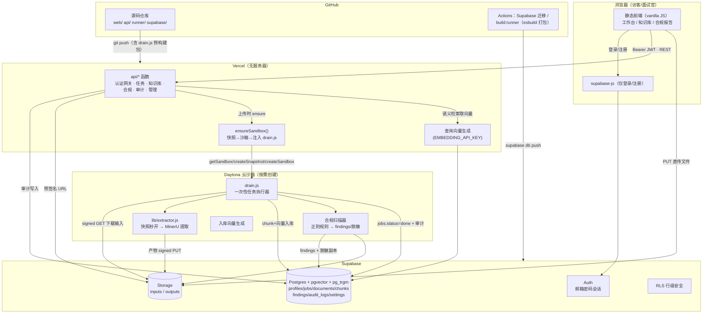
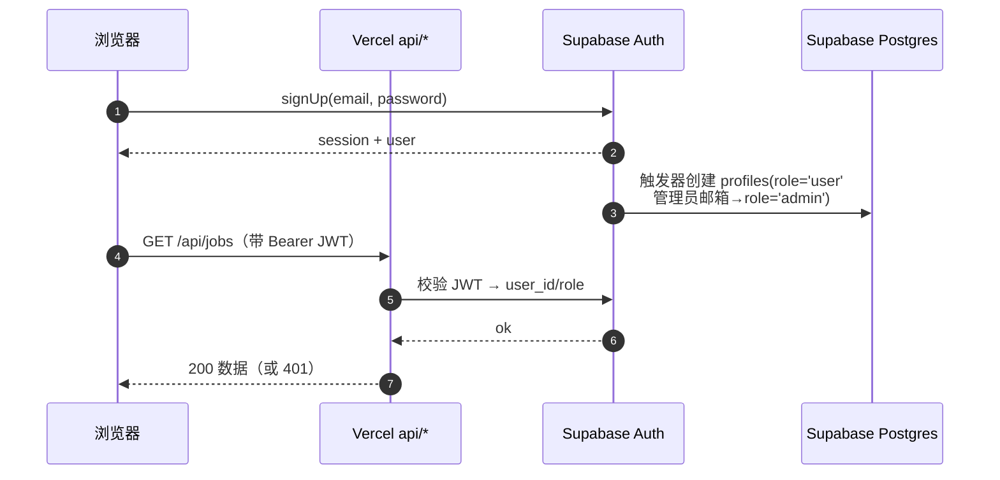
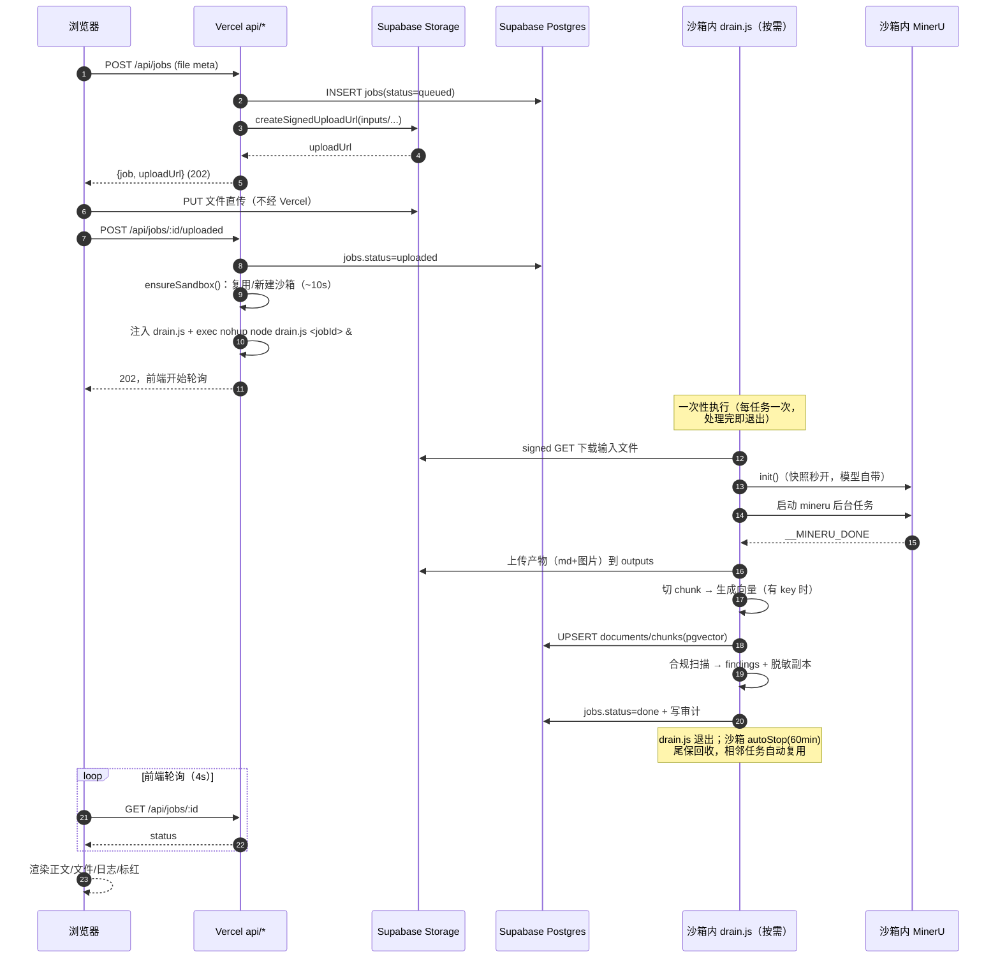
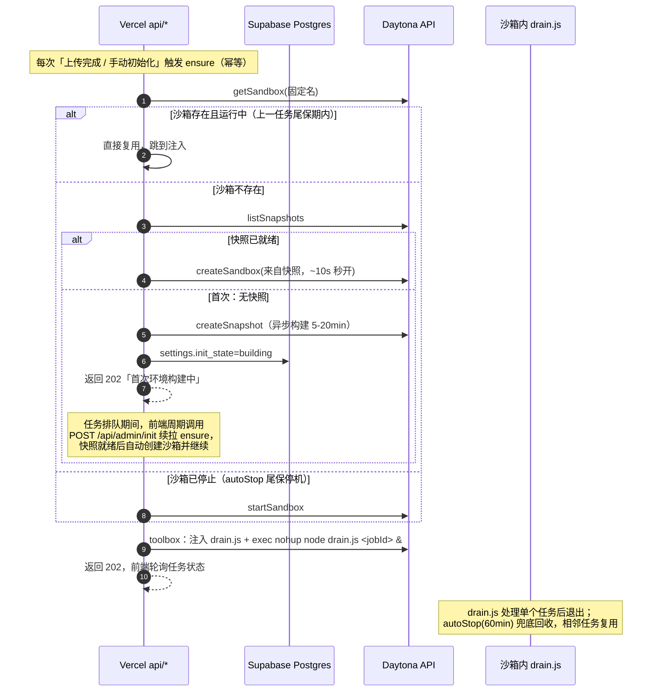
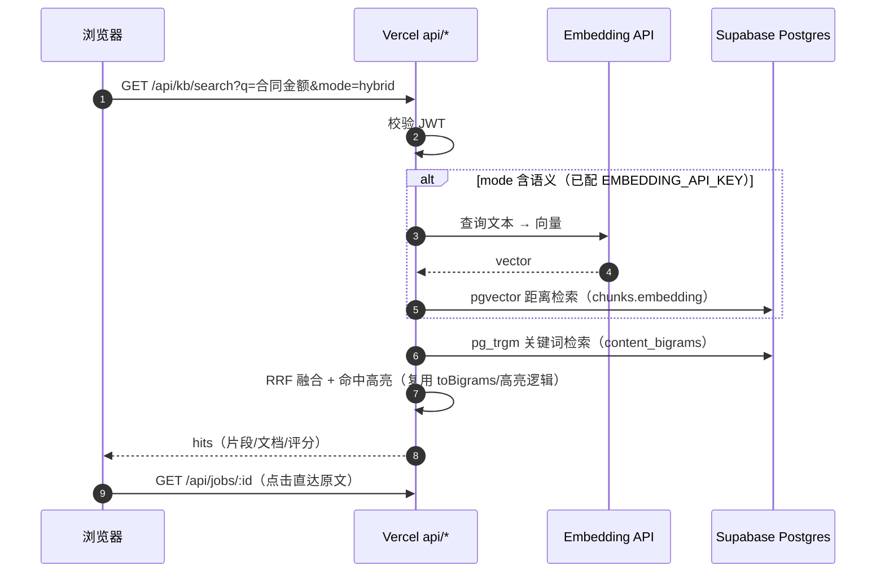
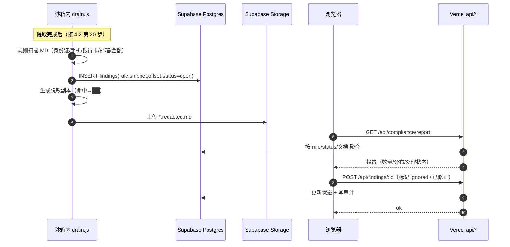
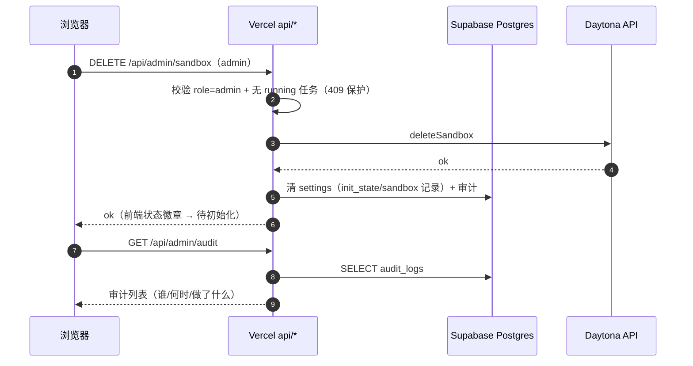
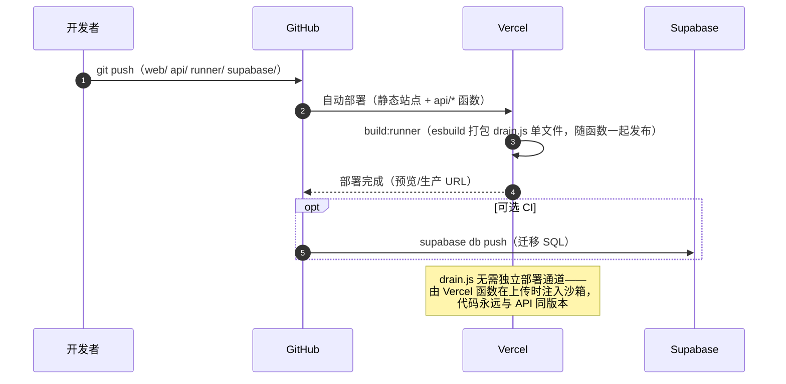

# MINERU·PRESS 技术架构与交互设计

> 技术路线：**GitHub + Vercel + Supabase + Daytona**
> 本文件回答两个问题：①整个系统由哪些组件构成、各自职责；②组件之间的交互逻辑（请求/数据流向）。
>
> 计算形态：**Daytona 按需沙箱 + 一次性任务执行器（drain.js）**，不留常驻 worker——只为任务付钱，空闲零成本（详见 `migration-plan.md` §5）。

---

## 0. 总览（ASCII）

```
 ┌────────────┐  HTTPS   ┌───────────────────────┐         ┌─────────────────────┐
 │  浏览器     │ ───────▶ │ Vercel                │  REST   │ Supabase            │
 │ 静态前端    │ ◀─────── │  · 静态站点            │ ──────▶ │  · Auth（邮箱密码）   │
 │ (vanilla)  │          │  · api/* 轻函数(<10s)  │ ◀────── │  · Postgres+pgvector │
 └─────┬──────┘          │  · 认证网关/审计        │         │  · Storage 桶       │
       │ 预签名直传        └──────────┬────────────┘         └─────────┬───────────┘
       ▼                             │ 上传时 ensure（快照→沙箱→      ▲
 ┌─────────────┐                     │ 注入并启动 drain.js）           │ 读任务/写结果
 │ Supabase    │  ←────────────  Daytona 云沙箱（按需创建，快照秒开）────┘
 │ Storage     │   signed URL       · drain.js：一次性任务执行器
 └─────────────┘                    · 下载输入 → MinerU 提取 → 回传产物
                                    · 入库/向量/合规扫描 → 写库 → 退出
                                    · autoStop 60min 尾保，相邻任务复用
 ┌────────────┐  git push ──▶ Vercel 自动部署（前端 + 函数 + drain.js 包）
 │ GitHub     │
 └────────────┘
```

---

## 1. 组件与职责

| # | 组件 | 职责 | 不做什么 |
|---|------|------|---------|
| 1 | **浏览器（静态前端）** | 渲染页面（工作台/知识库/合规报告）；调用 Supabase Auth 登录；调 Vercel API 读写数据；预签名直传文件到 Storage；轮询任务状态 | 不做任何业务计算；不持有 Daytona/Supabase service key |
| 2 | **Vercel（api/* 函数）** | 认证网关（校验 JWT）；任务/知识库/修正/审计/合规 API；**上传时 ensure**（复用/新建沙箱 + 注入并启动 drain.js）；语义检索时生成查询向量 | 不跑长任务；不中转文件体（≤4.5MB）；不存数据（无状态） |
| 3 | **Supabase** | Auth（用户/会话）；Postgres 数据（jobs/documents/chunks/findings/audit/settings）+ RLS；pgvector 语义检索 + pg_trgm 关键词；Storage（inputs/outputs） | 不做 MinerU 等计算密集型任务 |
| 4 | **Daytona 云沙箱（按需）** | 快照秒开的算力：跑 **drain.js 一次性任务执行器**（下载输入 → MinerU 提取 → 上传产物 → 入库+向量 → 合规扫描）；autoStop 60min 尾保回收 | 无常驻进程；不对外提供业务 API |
| 5 | **GitHub** | 源码；push → Vercel 自动部署（含 drain.js 预构建包）；Actions 可选 Supabase 迁移 | — |

**信任边界**：
- 浏览器只信 Supabase Auth 会话 + Vercel API（Bearer token）
- Vercel 函数持有 `DAYTONA_API_KEY`、Supabase service key（服务端 env，绝不下发浏览器）
- drain.js（沙箱内，由函数注入）持有 Supabase service key + Embedding key，属于可信计算域
- 所有数据访问强制经过 RLS 或函数内角色校验（admin/user）

---

## 2. 架构总图（Mermaid）



---

## 3. 基础设施交互矩阵

| 发起方 | 接收方 | 协议/方式 | 内容 | 触发时机 |
|---|---|---|---|---|
| 浏览器 | Supabase Auth | HTTPS REST（supabase-js） | 注册/登录/登出/刷新会话 | 用户操作 |
| 浏览器 | Vercel API | HTTPS REST（Bearer JWT） | 任务/检索/合规/审计/管理 | 用户操作 |
| 浏览器 | Supabase Storage | HTTPS PUT（预签名 URL） | 上传原文件（大文件绕过 Vercel） | 上传文件 |
| Vercel 函数 | Supabase | HTTPS REST（service key） | 读写表、建预签名 URL、审计写入 | 各 API 调用 |
| Vercel 函数 | 第三方 Embedding API | HTTPS | 查询文本 → 向量 | 语义/混合检索 |
| Vercel 函数 | Daytona | HTTPS REST（`lib/daytona.js`） | ensure：复用/新建/启动沙箱 | 上传完成时 |
| Vercel 函数 | 沙箱 | toolbox 注入 + exec | 上传 drain.js 单文件包并 `nohup node drain.js <jobId> &` | 上传完成时 |
| drain.js | Supabase | HTTPS REST（service key） | 读任务、写产物/向量/findings/状态、审计 | 每次任务 |
| drain.js | Supabase Storage | HTTPS signed URL | 下载输入、上传产物/脱敏副本 | 任务处理 |
| drain.js | 第三方 Embedding API | HTTPS | 文档 chunk → 向量 | 入库时 |
| drain.js | 沙箱内 MinerU | 本地进程 | `mineru -p input -o out` | 任务处理 |
| GitHub | Vercel | git push | 前端 + 函数 + drain.js 包自动部署 | 每次 push |
| GitHub Actions | Supabase | supabase CLI | 迁移 SQL 应用 | CI（可选） |

---

## 4. 核心时序（Mermaid 时序图）

### 4.1 注册 / 登录



### 4.2 核心链路：上传 → 云提取 → 入库 → 可检索



### 4.3 按需拉起：首次初始化与任务执行



### 4.4 检索（关键词 / 语义 / 混合）



### 4.5 合规扫描与报告



### 4.6 管理动作（admin）



### 4.7 部署流水线



---

## 5. 密钥与环境变量分布

| 密钥/变量 | 存放位置 | 说明 |
|---|---|---|
| `SUPABASE_URL` / `SUPABASE_ANON_KEY` | Vercel env + 前端静态 | anon 仅用于 Auth 客户端 |
| `SUPABASE_SERVICE_ROLE_KEY` | Vercel env + 沙箱创建时注入 env（drain.js 运行时） | 服务端/可信计算域，**绝不下发浏览器** |
| `DAYTONA_API_KEY` / `DAYTONA_API_URL` | **仅 Vercel env** | 沙箱创建/销毁/注入（drain.js 不需要调 Daytona） |
| `EMBEDDING_API_KEY` / `BASE_URL` / `MODEL` | Vercel env + 沙箱 env | 查询向量（函数）+ 入库向量（drain.js） |
| `ADMIN_EMAILS` | Vercel env | 注册时判定 admin 角色 |
| Sandbox 本地 `state.json` | 沙箱内 | 快照/模型就绪标记，drain.js 每次运行前校验，秒级复用 |

---

## 6. 与现有代码的对应关系

| 架构组件 | 复用/改写现有代码 |
|---|---|
| Vercel api/* | 由 `server.js`（763 行）按域拆分，路由与业务逻辑保留；新增 `ensureSandbox()` 帮助函数 |
| Daytona 任务执行 | `lib/extractor.js`（422 行，核心不动）+ `lib/daytona.js`（250 行，不动）+ `lib/embedding.js`（入库向量）+ 新增 `runner/drain.js`（一次性执行器：下载→提取→回传→入库→扫描；esbuild 预构建单文件，由函数注入沙箱） |
| Supabase 数据层 | `lib/knowledge.js` 的 chunk 切分/`toBigrams`/高亮逻辑移植为 SQL + JS；FTS5 → pg_trgm，SQLite 向量 → pgvector |
| 前端 | `public/`（app.js/index.html/styles.css）渲染逻辑基本保留，API 换新 + 登录态 + 合规报告页 |
| PDF 导出 | `lib/export-pdf.js` 改为前端浏览器打印（或 drain.js 内 headless Chrome，备选） |
| 部署 | 新增 `vercel.json`、`supabase/migrations/*.sql`、`scripts/build-runner.mjs`（esbuild 打包 drain.js） |
